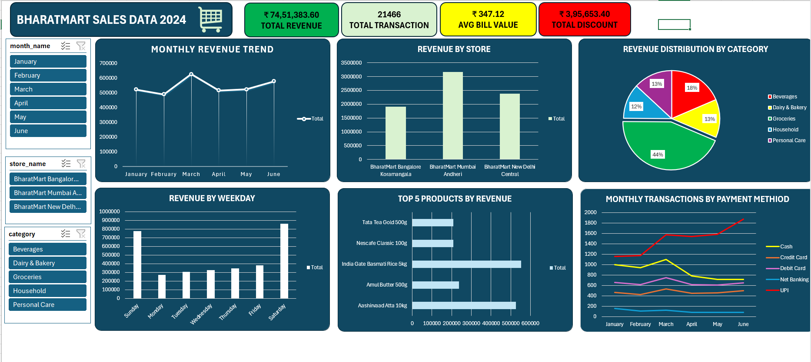

# 🛒 BharatMart Sales Dashboard

## 📌 Project Overview

The BharatMart Sales Dashboard is an interactive Microsoft Excel dashboard created to analyze retail sales performance and provide meaningful business insights.

The dashboard analyzes **21,466 retail transactions** across multiple store locations using advanced Excel features including Power Query, Power Pivot, DAX Measures, Pivot Tables, Pivot Charts, and Slicers.

---

## 📊 DASHBOARD Preview

> 

---

## 🎯 Objectives

- Analyze sales performance
- Compare store-wise revenue
- Track monthly sales trends
- Identify top-performing products
- Understand category contribution
- Monitor payment method trends
- Build an interactive dashboard for business decision-making

---

## 🛠 Tools & Technologies

- Microsoft Excel
- Power Query
- Power Pivot
- DAX Measures
- Pivot Tables
- Pivot Charts
- Slicers

---

## 📈 Dashboard Features

- 💰 Total Revenue
- 🛒 Total Transactions
- 💳 Average Transaction Value
- 🏷 Total Discount
- 📅 Monthly Revenue Trend
- 🏬 Revenue by Store
- 🥧 Revenue Distribution by Category
- 📦 Top 5 Products by Revenue
- 💳 Monthly Transactions by Payment Method

---

## 📊 Key Insights

- Analysed **21,466 retail transactions** across three store locations.
- Generated **₹74.5 Lakhs** in total revenue.
- Mumbai Andheri recorded the highest revenue among all stores.
- Groceries contributed the highest share of total revenue.
- Saturday was identified as the highest revenue-generating weekday.
- UPI transactions increased steadily during the six-month period while Cash transactions declined.
- Built an interactive dashboard with dynamic filtering using slicers.

---

## 📂 Files Included

- BHARATMART DASHBOARD.xlsx
- DASHBOARD.png
- DATASET.png

---

## 📚 Skills Demonstrated

- Data Cleaning
- Data Analysis
- Dashboard Design
- Business Intelligence
- Data Visualization
- Power Query
- Power Pivot
- DAX
- KPI Reporting

---

## 👨‍💻 Author

**Najmuj Sakib**

Aspiring Data Analyst

📧 najmujsakib773@gmail.com

🔗 LinkedIn:
https://www.linkedin.com/in/najmuj-sakib-532936219

🔗 GitHub:
https://github.com/njmzskb

---

## ⭐ Support

If you like this project, please consider giving it a ⭐ on GitHub.

Feedback and suggestions are always welcome.
